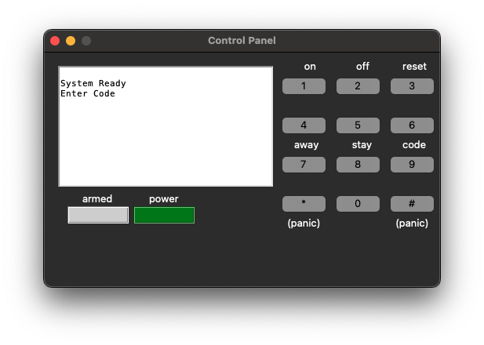
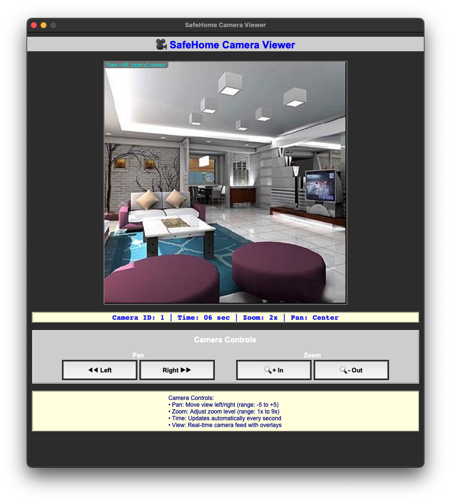
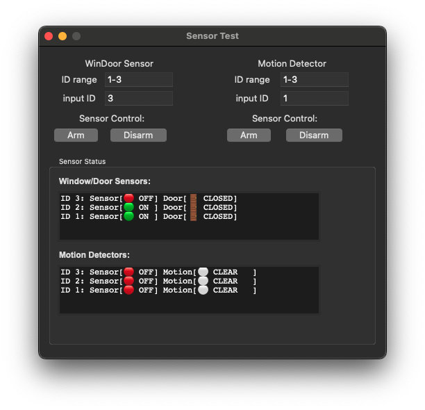

# SafeHome Python API (Summary)

## Requirments

python 3.14 (includes tkinter as part of its standard library)

Pillow>=10.0.0 (Python Imaging Library)

## Control Panel button callbacks

The control panel abstract class (```DeviceControlPanelAbstract```) defines callback methods to be implemented by a
subclass. In Python they are instance methods. Example names (implement these in
your subclass):

    def button0(self): ...
    def button1(self): ...
    def button2(self): ...
    def button3(self): ...
    def button4(self): ...
    def button5(self): ...
    def button6(self): ...
    def button7(self): ...
    def button8(self): ...
    def button9(self): ...
    def button_star(self): ...
    def button_sharp(self): ...


## Control Panel display API
----------------------------
APIs to control visual state of the SafeHome control panel. 

    set_security_zone_number(zone: int)
    set_display_away(on: bool)
    set_display_stay(on: bool)
    set_display_not_ready(on: bool)
    set_display_short_message1(message: str)
    set_display_short_message2(message: str)
    set_armed_led(on: bool)
    set_powered_led(on: bool)



## Camera interface (python)
----------------------------
The camera interface (```DeviceCamera```) provides a simple abstraction for a camera view and movement.
Methods are implemented according to the Python port in interface_camera.py.

    DeviceCamera()
    def set_id(self, id: int) # Set the camera ID and load "camera{id}.jpg"
    def get_id(self) -> int
    def get_view(self):  # returns an image object
    def pan_right(self) -> bool
    def pan_left(self) -> bool
    def zoom_in(self) -> bool
    def zoom_out(self) -> bool

- get_view() provide image object
- boolean returns indicate success/failure (e.g. limits reached).



## Sensor interface (python)
----------------------------
Sensors implement the interface defined in interface_sensor.py. Sensor ID sequences
are maintained per sensor type and start at 1. Typical methods:

    def get_id(self) -> int     
    def read(self) -> bool # return True when opened (window/door) or motion detected
    def arm(self) -> None
    def disarm(self) -> None
    def test_armed_state(self) -> bool   # returns sensor state

Behavior notes:
- Sensor read() returns True only when the sensor is enabled and in detected/opened state.
- Simulated state methods used by device implementations:
    - DeviceWinDoorSensor:
        def intrude(self):   # set opened True (simulate open)
        def release(self):   # set opened False (simulate close)
    - DeviceMotionDetector:
        def intrude(self):   # set detected True (simulate detect)
        def release(self):   # set detected False (simulate clear)



## Examples
-----------
Example scripts are provided under py_safehome/example/:
- example_all_sensors.py
- example_camera.py
- example_control_panel.py
